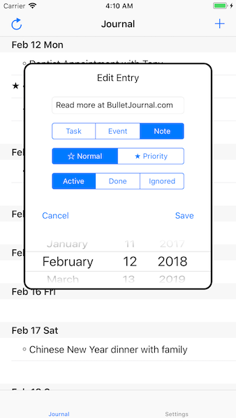

# Bullet Journal

What is a [bullet journal](http://bulletjournal.com/)?

It's a combo of a To-Do list, a planner, and a journal, with different bullet icons that identify what type of entry it is at a glance.

A bullet journal is meant to implemented with a notebook and a pen. Of course, then, it definitely needs an app version!

This app stores your journal to the internet via Firebase so you can login with any iDevice and grab your entries from anywhere with a connection.

### Install

Use `pod install` in terminal and that should do the trick. Open the `.xcworkspace` file after that. 

### Screenshots

| Journal View | Edit View | 
--- | --- |
|  |  | 

